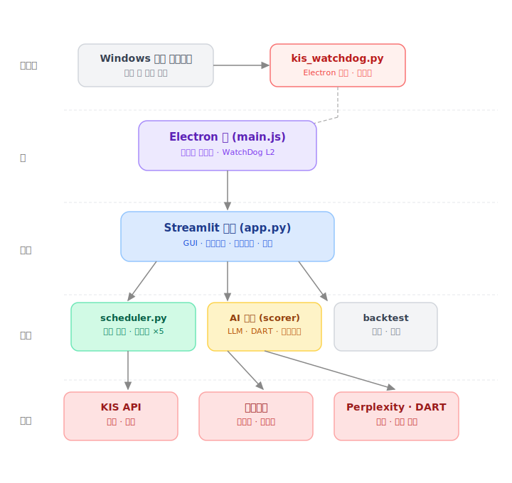
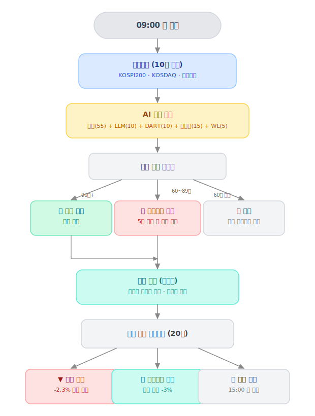
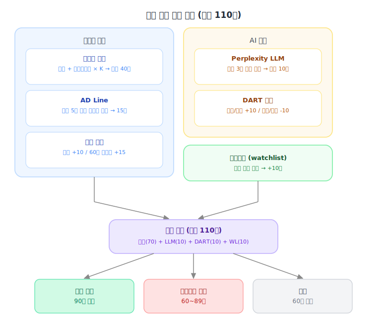
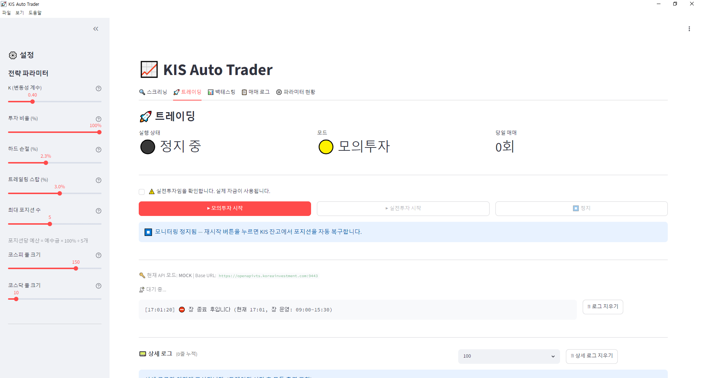
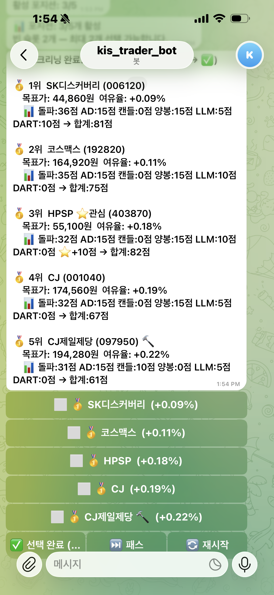
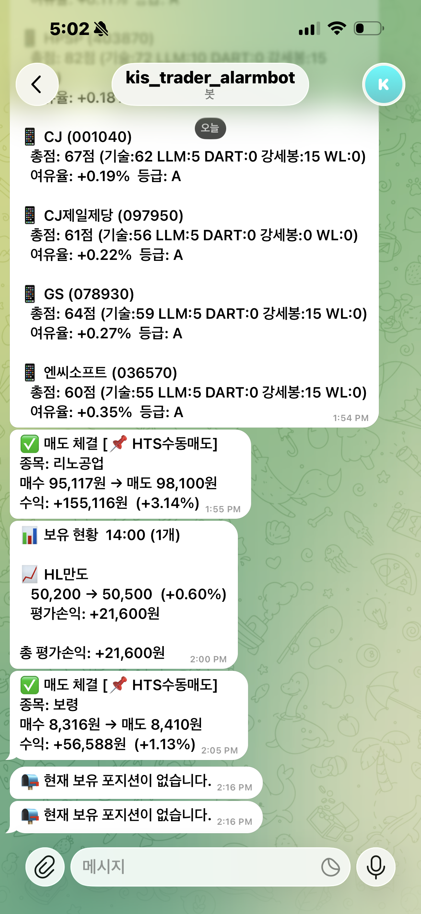
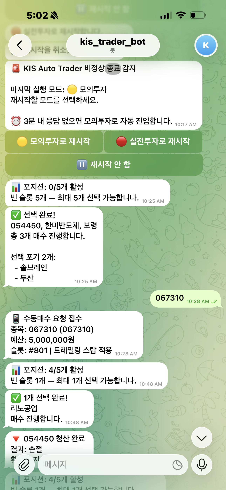

<div align="center">

# 📈 KIS Auto Trader

**한국투자증권 Open API 기반 주식 자동매매 시스템**

변동성 돌파 전략 · AI 점수 기반 종목 선별 · 멀티포지션 실시간 모니터링

[](https://python.org)
[](https://streamlit.io)
[](https://electronjs.org)
[]()

</div>

---

## 📌 프로젝트 개요

KIS(한국투자증권) Open API를 활용해 **래리 윌리엄스 변동성 돌파 전략**을 자동으로 실행하는 데스크탑 애플리케이션입니다.

단순한 자동매매를 넘어 **AI 뉴스 분석(Perplexity), DART 공시 분석, 60분봉 강세봉 감지** 등 다층적 필터링으로 종목을 선별하며, Electron 기반 데스크탑 앱으로 패키징해 일반 앱처럼 실행됩니다.

### 핵심 성과
- 변동성 돌파 전략 + AI 점수 시스템으로 **종목 선별 자동화**
- Threading 기반 **최대 5개 종목 동시 모니터링**
- WatchDog 2단계 구조로 **비정상 종료 시 자동 복구**
- 모의/실전 투자 **실제 운용 경험**

---

## 🛠 기술 스택

| 분류 | 기술 |
|------|------|
| **Backend** | Python 3.11 · Threading · KIS REST API |
| **Frontend** | Streamlit · Plotly · Electron |
| **AI / 데이터** | Perplexity sonar · DART Open API · yfinance |
| **알림** | Telegram Bot API (선택봇 + 알람봇 2개) |
| **인프라** | Windows Task Scheduler · WatchDog |
| **버전관리** | Git / GitHub |

---

## 🏗 시스템 아키텍처



---

## 💹 매매 흐름도



---

## 🤖 AI 점수 시스템



종목별 최대 110점 산출 후 점수 구간에 따라 자동 매수 / 텔레그램 확인 / 스킵으로 라우팅합니다.

| 구간 | 동작 |
|------|------|
| 90점 이상 | 🤖 텔레그램 확인 없이 자동 매수 |
| 60~89점 | 📱 텔레그램으로 선택 요청 (5분 타임아웃) |
| 60점 미만 | ⏭ 스킵 |

---

## ⚙️ 주요 기능

### 1. 자동 스크리닝
- KOSPI200 + KOSDAQ150 + 관심종목 대상 10분 주기 스크리닝
- 변동성 돌파 + AD Line + 캔들 패턴 + 60분봉 강세봉 조건 필터링
- AI 점수 산출 후 텔레그램으로 후보 목록 전송

### 2. 멀티포지션 모니터링
- 최대 5개 종목 동시 보유, 포지션별 독립 스레드 운용
- 매 20초마다 현재가 조회 → 트레일링 스탑 / 하드 손절 자동 실행
- HTS 수동 매수 종목도 잔고 감지 후 자동 모니터링 편입

### 3. WatchDog 자동 복구
```
[레벨 1] watchdog.bat    → Electron 앱 크래시 시 재시작
[레벨 2] Electron main.js → Streamlit 프로세스 크래시 시 재시작
[레벨 3] trading_state.json → 비정상 종료 감지 후 텔레그램으로 모드 선택 요청
```

### 4. 텔레그램 연동
- **선택봇**: 스크리닝 결과 인라인 버튼 전송 / 종목 멀티 선택 / 매도 종목 선택
- **알람봇**: 매수·매도 체결 알림 / 수익률 20분 주기 알림 / 스크리닝 결과 로그

### 5. 백테스팅
- 일봉 기반 장기 검증 + 분봉 기반 단타 검증
- 파라미터 그리드 서치 (K × 손절 × 트레일링 전 조합 계산)
- 캐시 활용으로 데이터 재수집 없이 반복 실행 가능

---

## 🔧 기술적 도전과 해결

### 1. 멀티포지션 동시 모니터링
**문제:** 여러 종목을 동시에 실시간 감시하면서 서로 간섭하지 않아야 함

**해결:** `threading.Thread` 기반 포지션별 독립 스레드 설계. 각 스레드는 자체 `stop_event`로 제어되며 `threading.Lock()`으로 토큰 캐시 동시 접근 방지

### 2. 모의/실전 API 키 완전 분리
**문제:** 런타임에 모드를 전환할 때 잘못된 API 키가 사용될 위험

**해결:** `config.reload(mode)` 함수로 `sys.modules` 내 모듈 속성을 동적으로 교체. `st.session_state`로 Streamlit 세션별 격리

### 3. 백테스트 그리드 서치 중 전역 파라미터 오염
**문제:** 그리드 서치 시 `strategy_config` 전역 모듈을 수정하면 실시간 트레이딩에도 영향

**해결:** `params` 딕셔너리를 함수 인자로 전달하는 방식으로 전역 참조 제거. 백테스트와 실시간 트레이딩이 완전히 독립적으로 동작

### 4. 비정상 종료 자동 복구
**문제:** 장 중 크래시 시 포지션 모니터링이 중단되어 손절 타이밍을 놓칠 수 있음

**해결:** `trading_state.json`으로 실행 상태 영속화. WatchDog 2단계 구조로 10초 내 자동 재시작 + 텔레그램으로 재시작 모드 선택

---

## 🖥 스크린샷

### 트레이딩 앱 화면



### 텔레그램 봇 사용 예시

| 스크리닝 결과 | 매수 선택 | 매도 / 수익 알림 |
|:---:|:---:|:---:|
|  |  |  |

---

## 🚀 빠른 시작

### 요구사항
- Python 3.11+
- Node.js 18+
- 한국투자증권 Open API 계정

### 설치

```bash
git clone https://github.com/bba2woong/Auto-trader-KIS.git
cd Auto-trader-KIS

# 자동 설치 (venv 생성 + 패키지 설치 + Electron 의존성 + 작업 스케줄러 등록)
setup.bat
```

### 환경변수 등록 (`sysdm.cpl` → 환경변수)

```
KIS_REAL_APP_KEY / KIS_REAL_APP_SECRET / KIS_REAL_ACCOUNT
KIS_MOCK_APP_KEY / KIS_MOCK_APP_SECRET / KIS_MOCK_ACCOUNT
TELEGRAM_BOT_TOKEN / TELEGRAM_CHAT_ID
TELEGRAM_ALARM_BOT_TOKEN / TELEGRAM_ALARM_CHAT_ID
PERPLEXITY_API_KEY (선택)
DART_API_KEY (선택)
```

### 실행

```bash
# WatchDog 포함 실행 (자동 재시작)
watchdog.bat

# 또는 단순 실행
KIS_Trader_실행.bat
```

브라우저에서 `http://localhost:8501` 접속

---

## 📋 전략 파라미터

| 파라미터 | 기본값 | 설명 |
|----------|--------|------|
| `K` | 0.4 | 변동성 계수 (권장: 0.3~0.7) |
| `LOSS_RATE` | 2.3% | 하드 손절 기준 |
| `TRAILING_STOP_RATE` | 3.0% | 고점 대비 트레일링 스탑 |
| `TRAILING_STOP_ACTIVATE_RATE` | 4.0% | 트레일링 스탑 활성화 최소 수익률 |
| `MAX_POSITIONS` | 5 | 동시 보유 최대 포지션 수 |
| `AUTO_BUY_SCORE` | 90 | 자동 매수 기준 점수 |

---

## ⚠️ 주의사항

- 이 소프트웨어는 개인 학습 목적으로 제작되었습니다
- 실전 투자 손실에 대한 책임은 사용자 본인에게 있습니다
- 백테스팅 결과는 미래 수익을 보장하지 않습니다
- KIS Open API 이용약관을 준수하여 사용하세요

---

## 📝 회고

### 잘된 점
- 설계 → 구현 → 테스트 → 배포 전 과정을 혼자 경험
- 실제 운용하며 발생하는 버그를 직접 발견하고 수정
- 멀티스레드, API Rate Limit, 동시성 문제 등 실전 트러블슈팅

### 개선할 점
- `strategy_config.py` 전역 모듈 → 추후 dataclass 기반 리팩토링 예정
- 백테스트 거래 수가 적어 통계적 유의성 보완 필요
- 실시간 주가 데이터 웹소켓 연동으로 API 호출 최소화

---

<div align="center">
<sub>Made with Python · Streamlit · Electron</sub>
</div>
